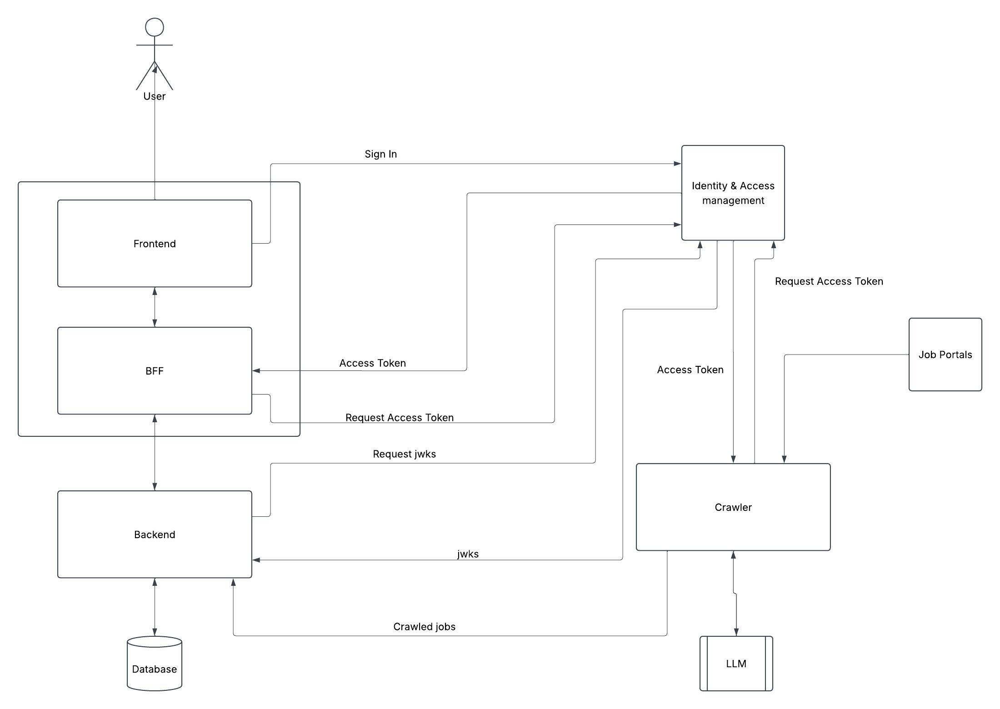

# Labour Market Analysis Project — System Architecture

This document explains the end-to-end architecture: how a user's request flows through the system, how authentication and authorization are enforced at each layer, and how labour market data is collected, classified, and stored.



---

## 1. Components

| Component | Role |
| :--- | :--- |
| **User** | Anyone using the this application dashboard. |
| **Frontend** | The Next.js UI the user interacts with — dashboards, KPI admin, occupation/industry analysis pages. |
| **BFF** | The Next.js "Backend for Frontend" layer. Every request from the browser passes through here before reaching the Go API — the browser never talks to the Backend directly, and never holds an access token itself. |
| **Backend** | The Go REST API. Owns all business logic and is the only component with a direct connection to the Database. |
| **Database** | PostgreSQL — the system of record for job postings, classification hierarchies, and KPI reference data. |
| **Identity & Access Management (IAM)** | ThunderID. Handles user sign-in, issues access tokens, and publishes the public keys (JWKS) other components use to verify those tokens. |
| **Crawler** | The Python service that scrapes external job boards, extracts structured job data via an LLM, deduplicates it, and submits it to the Backend. |
| **Job Portals** | External websites the Crawler scrapes |
| **LLM** | used by the Crawler to turn unstructured job-ad text into structured fields (employer, role, requirements, etc.) and to classify each posting into the occupation/industry hierarchy. |

---

## 2. Authentication: how a user signs in

```
User → Frontend → IAM ("Sign In")
```

When a user signs in, the Frontend (via the BFF's session layer) redirects them to IAM. The user authenticates directly against IAM — this application itself never sees or handles the user's password. Once authenticated, IAM establishes a session with the browser and the Frontend/BFF knows the user is signed in.

This is deliberately kept separate from the "Access Token" flow described next: signing in proves *who the user is*; requesting an access token is a separate step that proves *what a specific downstream call is allowed to do*.

---

## 3. Authorization: how the BFF calls the Backend on the user's behalf

```
BFF → IAM ("Request Access Token")
IAM → BFF ("Access Token")
BFF → Backend  (carries that token)
```

Whenever the BFF needs to call a protected Backend endpoint on behalf of the signed-in user, it first asks IAM for an access token scoped to the Backend's resource-server identifier. IAM issues a short-lived token whose audience (`aud`) is the Backend, and whose `scope` claim carries whatever permissions the user's role grants (e.g. `kpis:view`, `crawler:manage`). The BFF attaches this token to its request to the Backend as a Bearer token.

The access token itself never reaches the browser — it exists only in the server-side hop between the BFF and the Backend, which is the core benefit of the BFF pattern: even if the browser were compromised, there's no token in it to steal.

---

## 4. Token validation: how the Backend verifies a request without calling IAM every time

```
Backend → IAM ("Request jwks")
IAM → Backend ("jwks")
```

Rather than calling IAM synchronously on every single incoming request (which would make IAM a bottleneck and a single point of failure for every API call), the Backend fetches IAM's public signing keys (JWKS) periodically and caches them. When a request arrives with a Bearer token, the Backend checks locally:

1. **Signature** — was this token genuinely signed by IAM's private key, verified against the cached JWKS?
2. **Issuer** — does the token's `iss` claim match this specific IAM instance?
3. **Audience** — does the token's `aud` claim match this Backend's own resource-server identifier? (This stops a token that's valid for some *other* API from being replayed here.)
4. **Scope** — does the token's `scope` claim contain the specific permission this endpoint requires?

Only if all four checks pass does the request reach the actual business logic. This is what lets the Backend authenticate and authorize every request in-process, with no per-request round-trip to IAM.

---

## 5. Machine-to-machine access: how the Crawler authenticates

```
Crawler → IAM ("Request Access Token")
IAM → Crawler ("Access Token")
Crawler → Backend  (carries that token)
```

The Crawler is not a human user — it runs on a schedule with nobody signed in. It follows the same token-request pattern as the BFF, but as a machine client: it asks IAM for its own access token (scoped to the Backend, carrying whatever permission a scheduled ingestion job needs, e.g. `crawler:manage`) and attaches it to every batch-save/reconcile call it makes to the Backend. The Backend validates this token exactly the same way it validates a user-originated one — the four checks in Section 4 don't distinguish between "a human's request, forwarded by the BFF" and "a scheduled job's own request."

---

## 6. Data ingestion: from job posting to structured record

```
Job Portals → Crawler
Crawler ↔ LLM
Crawler → Backend ("Crawled jobs")
Backend ↔ Database
```

1. The Crawler scrapes each configured job portal for new postings. Before sending to LLM, the Crawler checks each posting against previously-seen postings (MinHash/LSH-based deduplication) so the same ad isn't stored twice under two different portals or crawl runs.
2. Each posting's raw text is sent to the LLM, which extracts it into application's structured schema (employer, role, location, description, and the KPI/classification fields) and — in a separate pass — classifies it into the correct occupation and industry hierarchy node.
3. New, non-duplicate postings are submitted to the Backend in batches; the Backend persists them to the Database and links them to the correct classification hierarchy rows.

The same ingestion path also accepts postings sourced from scanned newspapers, submitted through an MCP-connected AI assistant rather than a portal — the assistant extracts the listing from the image and the request joins the pipeline at the same "Crawler → Backend" step shown above.

---

## 🛠 Tech Stack

| Component | Technology |
| :--- | :--- |
| Database | PostgreSQL |
| Backend | Golang |
| BFF (Backend for Frontend) & Frontend | Next.js |
| Crawler | Python & Crawl4AI |
| ORM | GORM |
| Local Development | Docker Compose (Rancher) |